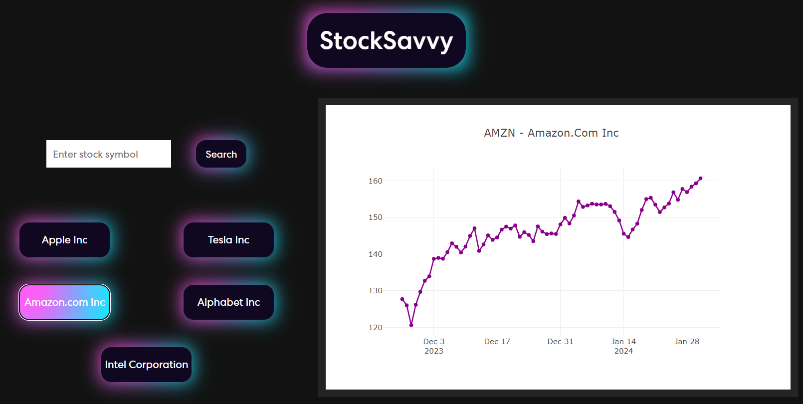
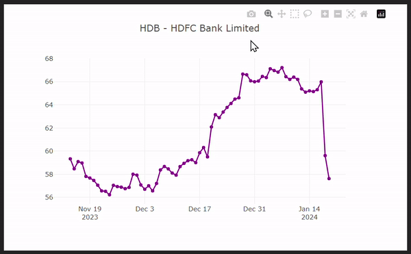
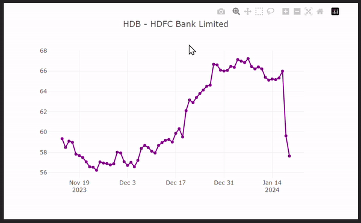

# <p align="center">   </p>

This innovative project is developed using React.js, offering a dynamic and responsive user interface. To provide users with stock data, StockSavvy integrates seamlessly with the Polygon.io REST API. Leveraging the power of React.js, the application ensures a smooth and interactive experience, enabling users to explore and analyze stock information effortlessly.

## Features

- **Users can initiate specific stock searches or conveniently choose from a curated list of provided stocks.**

  


- **Dive into historical stock performance by seamlessly scrubbing through an interactive line graph covering the opening prices of the last 100 days.**

  


- **The graph, powered by Plotly.js, offers a responsive design, facilitating easy zooming for users through intuitive cursor interactions.**

  

## Installation

Within your command prompt:

1. **Clone the repository:**

  ```bash
   git clone https://github.com/ericjyr/StockSavvy.git
  ```

2. **Navigate to the project directory**
   
  ```bash 
  cd c://path/to/StockSavvy
  ```

4. **Install the dependencies**

  ```bash
  npm install
  ```

5. **Start the development server**

  ```bash
  npm start  
  ```

To make the API endpoints work you must create an account and aquire a free API key from [ polygon.io ](https://polygon.io/) and enter it in the API_KEY constant variable found in the actionsApi.js file
